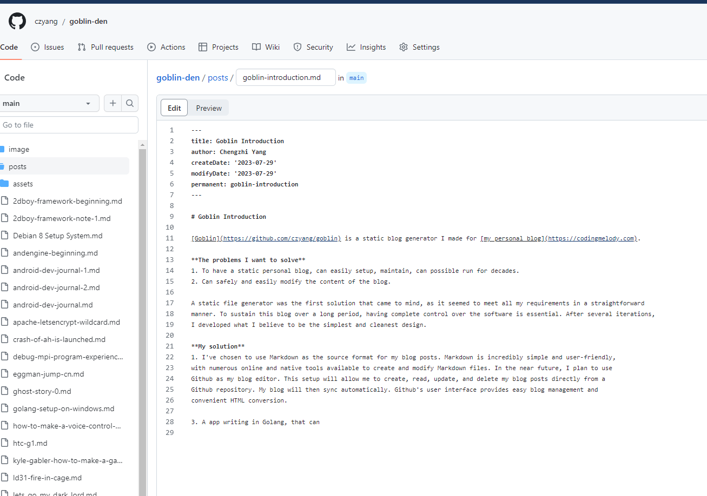

# Goblin Introduction

[Goblin](https://github.com/czyang/goblin) is a static blog generator I made for [my personal blog](https://codingmelody.com). 

## The problems I want to solve
1. To have a static personal blog, can easily setup, maintain, can possible run for decades.
2. Can safely and easily modify the content of the blog.

A static file generator was the first solution that came to mind, as it seemed to meet all my requirements in a straightforward 
manner. To sustain this blog over a long period, having complete control over the software is essential. After several iterations, 
I developed what I believe to be the simplest and cleanest design.

## My solution
### 1. I've chosen to use Markdown as the source format for my blog posts.

Markdown is incredibly simple and user-friendly, with numerous online and native tools available to create and modify 
Markdown files. In the near future, I plan to use Github as my blog editor. This setup will allow me to create, read, 
update, and delete my blog posts directly from a Github repository. My blog will then sync automatically. Github's 
user interface provides easy blog management and convenient HTML conversion.

Edit in Github web:



### 2. A app writing in Golang

golang is very suitable for this use case. At this point, it's only 449 lines of go code.

```bash
find . -name "*.go" ! -path "./vendor/*" -print0 | xargs -0 wc -l

  17 ./config.go
  85 ./file_helper.go
  25 ./markdown_blog.go
  73 ./sitemap.go
 101 ./post.go
  40 ./main.go
  62 ./models.go
  46 ./pages.go
 449 total
```

### 3. A standalone Blog Repo

All my blog posts and other static fils(index.html) all lies in the repo [Goblin Den](https://github.com/czyang/goblin-den)

### 4. A ChatGPT write script use for sync

ChatGPT is at least of the god for script writing, I can effortlessly write a script doing some non-trivial job, for example,
periodically sync folder from remote git repo, and generate my blog posts. 
[fire-ball.sh](https://github.com/czyang/goblin-den/blob/main/fire-ball.sh)
